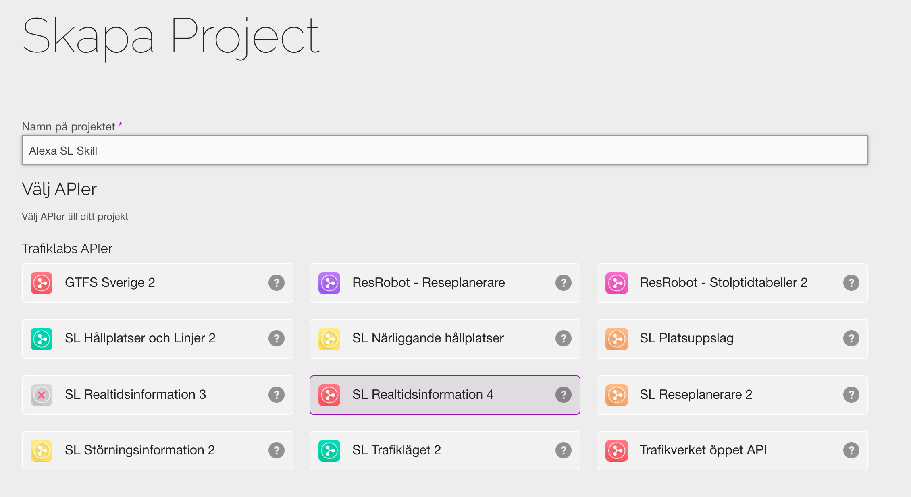
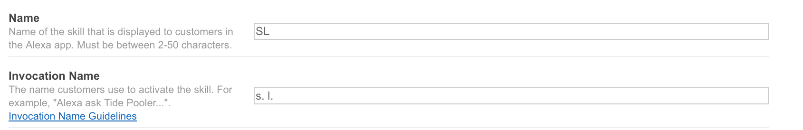
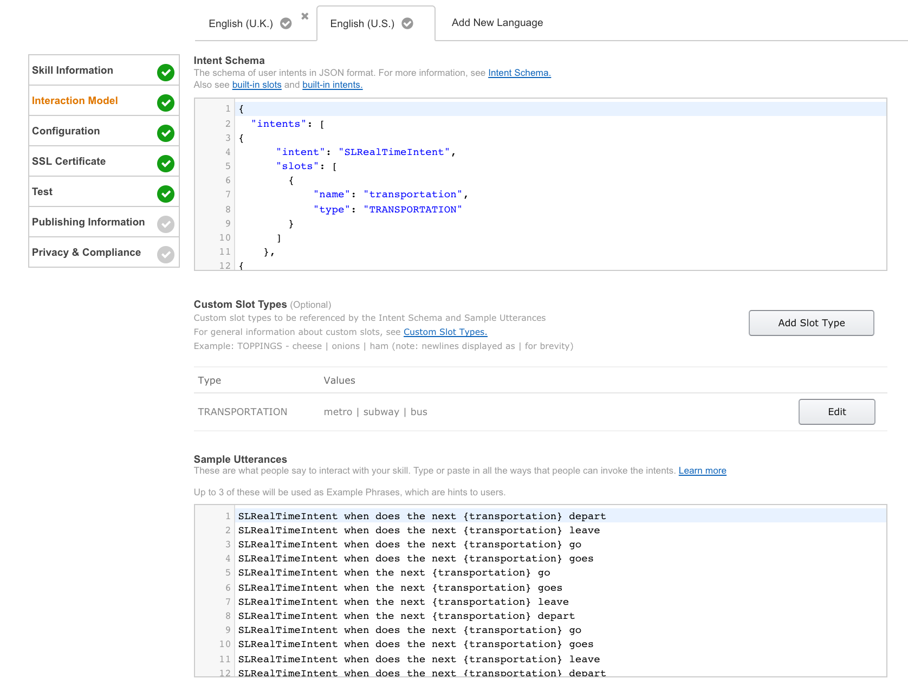

# alexa-sl
Alexa Skill to tell you when the metro/bus leaves

###Requirements:
- Dokku or Heroku
- Trafiklab account for API access
- Amazon Developer Account

###Amazon
Use supplied files in Alexa to create your skill

###Needed variables in Dokku
    SL_BUS_SITE_ID:         ID for closest bus stop
    SL_METRO_SITE_ID:       ID for closest metro station
    SL_API_KEY:             API key from Trafiklab
    TTS_HOST:               URL which returns a MP3 f.ex. (https://tts/sv/)

###Small Guide
- Create Project at Trafiklab

- Create Alexa skill

- Add Intent Schema/Custom Slot Type/Sample Utterances

- Define Service endpoint, make sure you got a valid SSL-certificate on the endpoint
